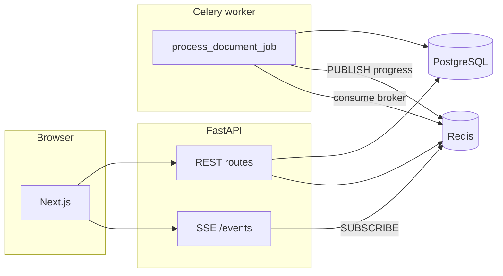

# DocFlow — Async document processing workflow

Full-stack demo: upload documents, enqueue **Celery** jobs backed by **Redis**, track **live progress** via **Redis Pub/Sub** (consumed by the API and exposed as **SSE**), review and edit structured output in **PostgreSQL**, **finalize**, and **export** JSON/CSV.

## Architecture overview

| Layer | Technology |
|--------|------------|
| Frontend | Next.js 14 (App Router), TypeScript, Tailwind |
| API | FastAPI, SQLAlchemy 2 async, Pydantic v2 |
| Database | PostgreSQL (documents, jobs, JSON results) |
| Queue | Celery, Redis DB 1 (broker), Redis DB 2 (results backend) |
| Progress | Workers `PUBLISH` to Redis Pub/Sub channel `job:{id}:progress`; API SSE subscribes and streams to clients |
| File storage | Local disk (`LocalFileStorage` — swappable for S3-compatible storage) |

**Important:** No document parsing runs inside HTTP request handlers. Upload only stores the file, persists rows, commits, then calls `process_document_job.delay(job_id)`.



## Setup (local)

**Prerequisites:** Python 3.10+ (Dockerfile uses 3.12), Node 20+, PostgreSQL 16, Redis 7.

### Quick start (one terminal)

From the repo root, install Python deps for the backend (`pip install -r backend/requirements.txt` in a venv if you use one), ensure **PostgreSQL** has database `docflow` and **Redis** is on port **6379**, then:

```bash
npm install    # installs concurrently + runs frontend npm install
npm run dev    # starts API :8000, Next :3000, and Celery worker
```

Open **http://localhost:3000** (not `:8000` unless you only want the API docs). If the browser shows **ERR_CONNECTION_REFUSED**, nothing is listening on that port—run `npm run dev` or start each service manually (see below).

1. **PostgreSQL & Redis** — or use Docker only for infra:

   ```bash
   docker compose up -d db redis
   ```

2. **Backend**

   ```bash
   cd backend
   cp .env.example .env   # adjust URLs if needed
   python -m venv .venv && source .venv/bin/activate
   pip install -r requirements.txt
   mkdir -p uploads
   uvicorn app.main:app --reload --host 0.0.0.0 --port 8000
   ```

3. **Celery worker** (separate terminal, same venv and `cwd` = `backend`):

   ```bash
   export PYTHONPATH=.
   celery -A app.celery_app worker -l info
   ```

4. **Frontend**

   ```bash
   cd frontend
   cp .env.local.example .env.local
   npm install
   npm run dev
   ```

Open [http://localhost:3000](http://localhost:3000). API docs: [http://127.0.0.1:8000/docs](http://127.0.0.1:8000/docs).

## Run with Docker Compose (full stack)

From the repo root:

```bash
docker compose up --build
```

- API: `http://localhost:8000`
- Web: `http://localhost:3000`
- Uploads persist in the `uploads` volume (shared between API and worker).

## API surface (summary)

| Method | Path | Purpose |
|--------|------|---------|
| `POST` | `/api/v1/documents/upload` | Multipart `files` → creates documents + queued jobs, then enqueues Celery after commit |
| `GET` | `/api/v1/jobs` | List with `search`, `status`, `sort` |
| `GET` | `/api/v1/jobs/{id}` | Job + document + result payloads |
| `GET` | `/api/v1/jobs/{id}/events` | **SSE** stream of progress JSON events |
| `GET` | `/api/v1/jobs/{id}/progress` | Polling: DB fields + last Redis-cached event |
| `POST` | `/api/v1/jobs/{id}/retry` | Re-queue failed/completed jobs (blocked if finalized or already queued/processing) |
| `PATCH` | `/api/v1/jobs/{id}/result` | Update `reviewed_result_json` |
| `POST` | `/api/v1/jobs/{id}/finalize` | Copy reviewed/result to `finalized_result_json` |
| `GET` | `/api/v1/export/finalized?format=json\|csv` | Download all finalized records |

## Processing stages (worker)

Events published over Pub/Sub include: `job_queued`, `job_started`, `document_received`, `document_parsing_started`, `document_parsing_completed`, `field_extraction_started`, `field_extraction_completed`, `final_result_stored`, `job_completed`, `job_failed`.

Structured output is heuristic (filename, size, mime, parsed text sample → title, category, summary, keywords).

## Assumptions

- Single-tenant demo: **no authentication** (bonus would add JWT/OAuth).
- Files are bounded by practical upload limits (reverse proxy / Starlette defaults); **large-file** hardening (virus scan, size quotas, streaming to object storage) is left as production follow-up.
- **Retry** is **idempotent** in the sense that finalized jobs cannot be retried; in-flight jobs are rejected to avoid duplicate workers.

## Tradeoffs

- **SSE** instead of WebSockets: one-way progress fits SSE; less moving parts than WS.
- **Redis key** `job:{id}:progress:last` supports polling and initial SSE snapshot without scanning history.
- **Synchronous SQLAlchemy session in the worker** keeps Celery tasks simple; the API stays fully async.
- **create_all on API startup** instead of Alembic migrations for the assignment footprint (migrations recommended for production).

## Limitations

- No job **cancellation** (bonus).
- No OCR / ML; extraction is **mock/simulated**.
- Export is **all finalized jobs** (not a single-job export).

## Tests

```bash
cd backend && PYTHONPATH=. pytest tests/ -q
```

## Sample files & exports

See [`samples/`](samples/): example uploads and [`samples/export_finalized.example.json`](samples/export_finalized.example.json).

## Demo video

Record a **3–5 minute** screen capture showing: upload → live progress on job detail → edit JSON → finalize → export. Upload the video to your preferred host and link it from your submission / this README.

## AI tools disclosure

This repository was implemented with assistance from **AI coding tools** (architecture, code generation, and documentation). All behavior was reviewed for fit with the assignment constraints (Celery out-of-band processing, Redis Pub/Sub, SSE, PostgreSQL).
